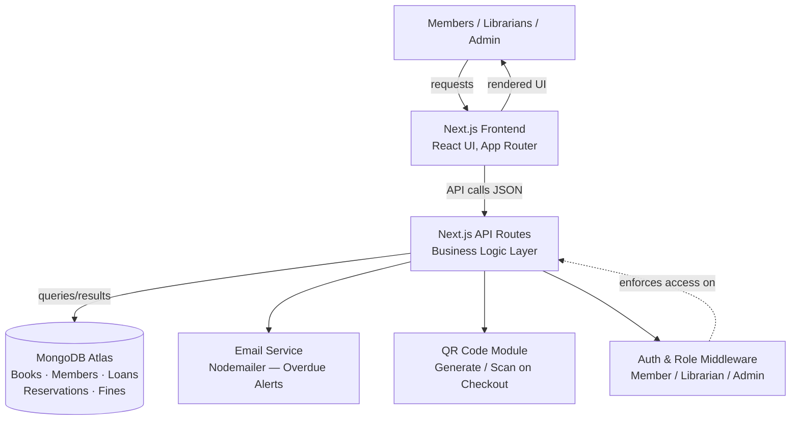
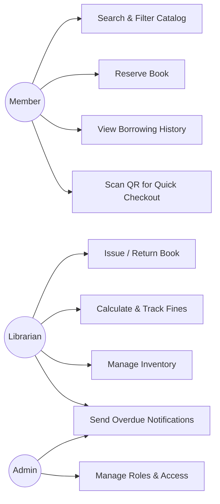
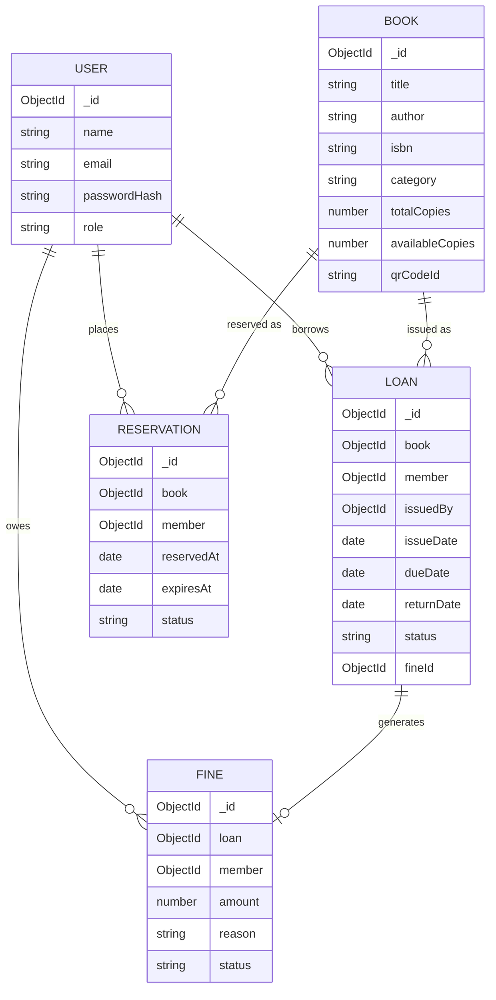
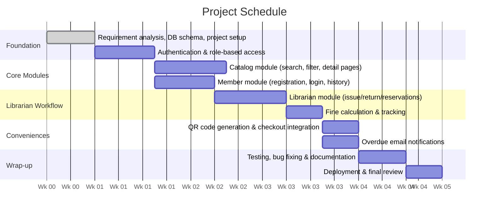

# Digital Library Management System

A role-aware, full-stack web application that replaces manual, register-based
library operations with a single digital platform — covering cataloging,
search, member self-service, issuing/returns, fine tracking, QR-code
checkout, and automated overdue notifications.

---

## Table of Contents
1. [Problem Statement](#problem-statement)
2. [Objectives & Scope](#objectives--scope)
3. [Tech Stack](#tech-stack)
4. [System Architecture](#system-architecture)
5. [Use Cases & Roles](#use-cases--roles)
6. [Data Model](#data-model)
7. [Design System / Theme](#design-system--theme)
8. [Action Plan / Roadmap](#action-plan--roadmap)
9. [Getting Started](#getting-started)
10. [Environment Variables](#environment-variables)
11. [Project Structure](#project-structure)
12. [Security & Data Integrity Notes](#security--data-integrity-notes)
13. [Future Work](#future-work)
14. [References](#references)

---

## Problem Statement

Most college and community libraries still rely on manual registers or
disconnected spreadsheets to track book inventory, member records, and due
dates. This creates several recurring problems:

- Members can't check book availability without visiting in person.
- Librarians spend significant time manually calculating overdue fines.
- There's no centralized way to track borrowing history or generate usage
  reports.
- Members frequently miss due dates because there's no automated reminder.

As collections grow, these manual processes become increasingly error-prone
and time-consuming. There's a clear need for a unified digital platform that
lets members search and reserve books remotely, lets librarians manage
inventory and loans efficiently, and automates repetitive tasks like fine
calculation and due-date reminders.

## Objectives & Scope

**Primary objective:** design and build a Digital Library Management System
that digitizes the complete lifecycle of library operations — cataloging,
search, issuing, returning, and fine collection — through a responsive web
application.

**Specific objectives:**
- Searchable, filterable digital catalog of the book collection
- Member registration, login, reservations, and borrowing history
- Librarian tools to issue/return books, manage reservations, track inventory
- Automatic overdue fine calculation with a per-member due record
- QR-code-based quick checkout for each catalog entry
- Automated email notifications as due dates approach or pass
- Role-based access so Members, Librarians, and Admins each see only what's
  relevant to them

**Scope for v1 (initial release):** the core loan-management workflow above.
E-book purchase, a recommendation engine, multi-branch inventory, and payment
gateway integration are documented as **planned future work** (see
[Future Work](#future-work)) rather than part of the first deliverable, so
the core system can be built, tested, and polished within the available
timeline.

## Tech Stack

| Layer | Choice |
|---|---|
| Frontend & Backend | Next.js (App Router + API Routes), TypeScript |
| Styling | Tailwind CSS (civic/gov-style theme — see [Design System](#design-system--theme)) |
| Database | MongoDB (Atlas) via Mongoose ODM |
| Auth | NextAuth.js, JWT sessions, role-based access control |
| Email | Nodemailer (overdue/due-date alerts) |
| QR Codes | `qrcode` / `react-qr-code` |
| Version Control | Git & GitHub |
| Deployment | Vercel (app) + MongoDB Atlas (data) |

## System Architecture

A user's request flows from the Next.js frontend to API routes, which apply
business logic (availability checks, fine calculation, role checks) before
reading from or writing to MongoDB. Two supporting modules — an email
service for overdue notifications and a QR-code module for quick checkout —
sit alongside the core API layer.



### Module Boundaries & Build Order

| Order | Module | Depends On |
|---|---|---|
| 1 | Auth & RBAC | — (foundation) |
| 2 | Catalog (search, filter, detail pages) | Auth |
| 3 | Member module (registration, login, history) | Auth |
| 4 | Librarian module (issue/return/reservations) | Catalog, Member |
| 5 | Fine engine | Librarian module (Loans) |
| 6 | QR checkout | Catalog, Librarian module |
| 7 | Email notifications | Loans, Fines |

This order exists because later modules read/write data shaped by earlier
ones — e.g. fines depend on loans existing, and QR checkout depends on the
catalog and auth being in place.

## Use Cases & Roles



| Role | Can Do |
|---|---|
| **Member** | Browse/search/reserve books, view own borrowing history and fines, scan QR at checkout |
| **Librarian** | Issue/return books, manage reservations and inventory, track fines, trigger notifications |
| **Admin** | Everything a librarian can, plus manage roles & access, and waive fines |

## Data Model



**Key invariants:**
- `Loan.status = "overdue"` is never trusted as a scheduler-written value —
  it's computed at the API layer (`dueDate < now && returnDate == null`) and
  only persisted when a librarian returns a book late.
- `availableCopies` updates use an atomic `findOneAndUpdate` with an
  `{ $gt: 0 }` guard to prevent race conditions on the last copy.
- Self-registration is locked to the `member` role only; `librarian` and
  `admin` accounts are created via a seed script, not public signup.
- Fine ↔ Loan writes follow a fixed order (create Fine → update Loan) so a
  partial failure leaves a recoverable, not orphaned, state.

Full schema detail: see `SCHEMA.md`.

## Design System / Theme

The UI follows a **flat, high-trust civic-services aesthetic** (in the style
of gov.uk / usa.gov) rather than a typical startup/SaaS look — no gradients,
glassmorphism, drop shadows, or pill-shaped buttons.

| Token | Hex | Usage |
|---|---|---|
| Background | `#F5F1E8` | Page background |
| Surface | `#FFFDF8` | Cards, panels, table rows |
| Primary | `#6B3E26` | Headers, nav, primary buttons |
| Secondary | `#8B5E3C` | Secondary buttons, hover states |
| Accent | `#D4AF37` | Underlines, badges, small highlights only |
| Text | `#2C2C2C` | Body copy |

Typography: system sans-serif stack, consistent heading hierarchy, high
contrast throughout. Data-heavy views (catalog, loans, fines) use bordered,
striped tables rather than floating cards. All interactive elements have
visible keyboard focus states for accessibility.

## Action Plan / Roadmap

Originally scoped as a 4-week (28-day) build; sequenced so each module only
starts once its dependencies are functional.



> Note: if compressing this into a shorter timeline, keep modules in the same
> dependency order — Auth → Catalog/Member → Librarian workflow → Fines —
> and treat QR checkout / email notifications as stretch goals, since they
> depend on everything before them but nothing depends on them.

Detailed, checkable task list: see `TODO.md`.

## Getting Started

```bash
# install dependencies
npm install

# copy env template and fill in real values
cp .env.example .env.local

# seed a librarian and admin account (self-registration is member-only)
npm run seed

# run the dev server
npm run dev
```

Open http://localhost:3000.

## Environment Variables

See `.env.example` for the full list. At minimum you'll need:
- `MONGODB_URI` — MongoDB Atlas connection string
- `NEXTAUTH_SECRET` / `NEXTAUTH_URL`
- SMTP credentials for Nodemailer (host, port, user, pass)
- `NEXT_PUBLIC_APP_URL` — base URL used to encode QR checkout links

## Project Structure

```
.
├── app/                  # Next.js App Router pages & layouts
│   ├── (auth)/login       register
│   ├── catalog/
│   ├── member/dashboard/
│   ├── librarian/dashboard/
│   └── admin/dashboard/
├── app/api/              # API route handlers (auth, books, loans, fines...)
├── lib/                  # Business logic, DB connection, helpers
├── models/               # Mongoose schemas
├── components/           # Shared UI components
├── AGENTS.md             # Agent/IDE instructions
├── PRD.md                # Product requirements
├── ARCHITECTURE.md        # System design detail
├── SCHEMA.md              # Data model detail
├── TODO.md                # Build checklist
└── .env.example
```

## Security & Data Integrity Notes

- All API routes validate the session and role **before** touching data —
  no route queries the DB before an auth/role check.
- Self-registration is restricted to the `member` role; `librarian`/`admin`
  accounts exist only via the seed script, preventing an RBAC bypass through
  signup.
- Fine waiving is restricted to `admin`; both `librarian` and `admin` can
  mark a fine as `paid`.
- Concurrent issue requests for the last copy of a book are handled with an
  atomic MongoDB update, not a read-then-write check.

## Future Work

Deferred beyond v1 so the core loan-management workflow could be built,
tested, and polished within the available timeline:

- E-book support and e-book purchase
- Recommendation engine based on borrowing history
- Multi-branch inventory and loan management
- Shareable member reading lists
- Analytics dashboard (most-borrowed books, active members, trends)
- Bulk CSV import with automatic ISBN metadata fetch
- Payment gateway integration (Stripe/Razorpay) for fees and fines

## References

1. [Next.js Documentation](https://nextjs.org/docs) — Vercel Inc.
2. [MongoDB Documentation](https://www.mongodb.com/docs/) — MongoDB Inc.
3. [Mongoose ODM Documentation](https://mongoosejs.com/docs/)
4. [NextAuth.js Documentation](https://next-auth.js.org/)
5. [Nodemailer Documentation](https://nodemailer.com/)